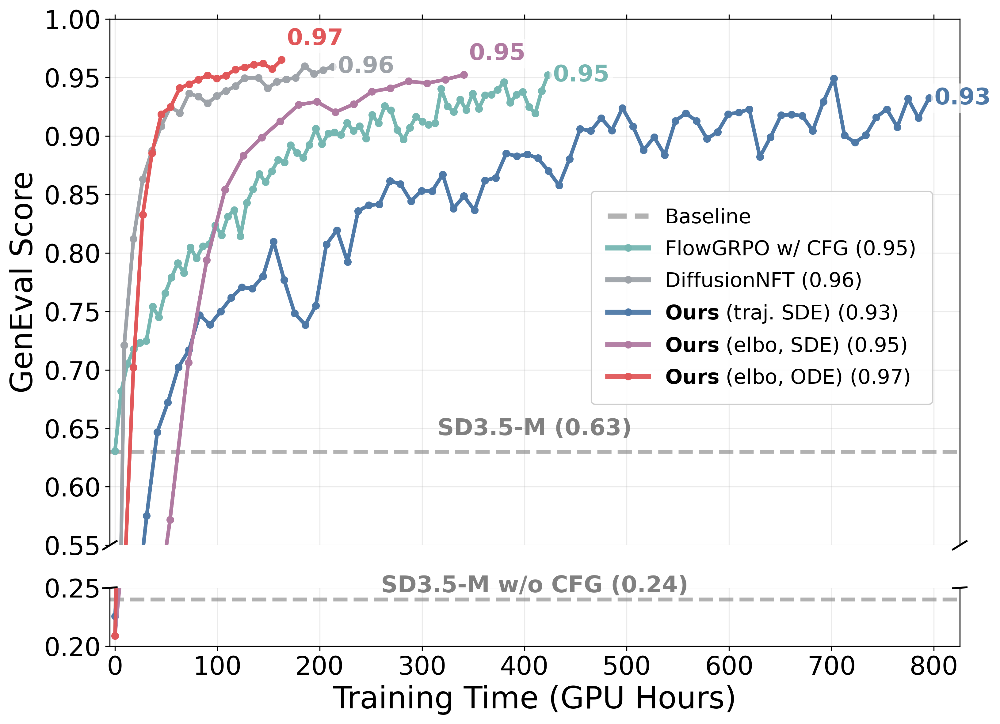
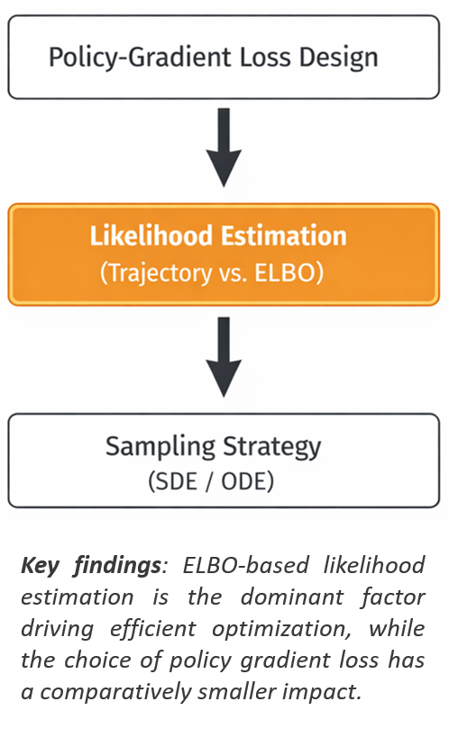
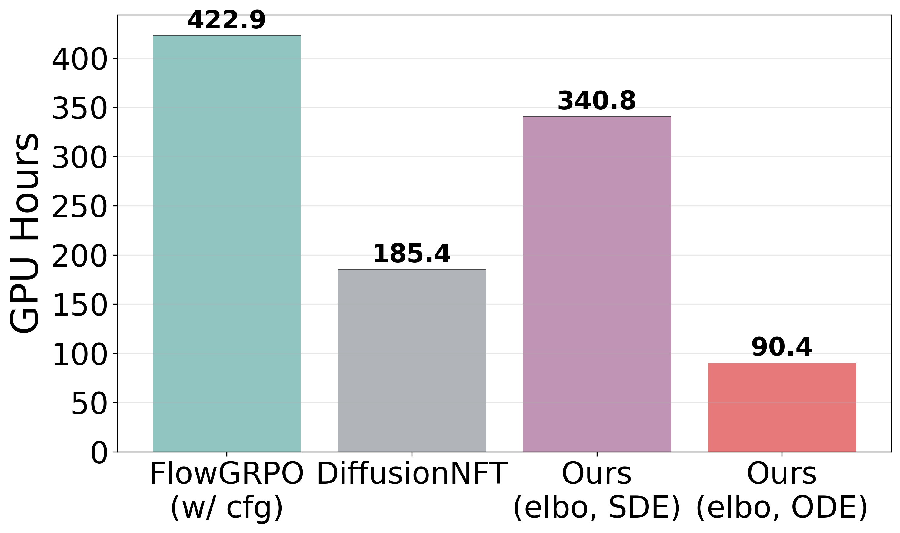
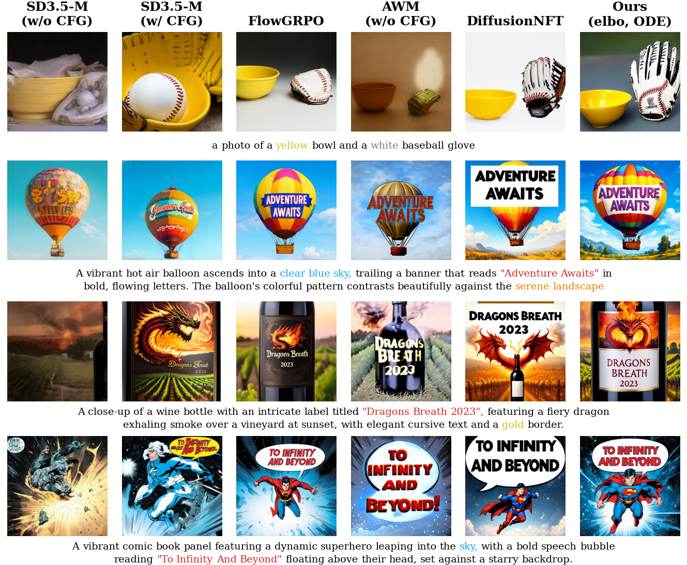

# Rethinking the Design Space of Reinforcement Learning for Diffusion Models

### On the Importance of Likelihood Estimation Beyond Loss Design

[](https://arxiv.org/abs/XXXX.XXXXX)
[](LICENSE)
[](https://icml.cc/)

This is the official implementation of **Rethinking the Design Space of Reinforcement Learning for Diffusion Models**.

<p align="center">
  
  
</p>

> **Training efficiency and design-space analysis for reward-based diffusion fine-tuning.**
> *(Left)* GenEval performance across training time for various fine-tuning methods on SD3.5-Medium.
> *(Right)* Conceptual summary of the design space considered in this work, highlighting policy-gradient loss design, likelihood estimation, and sampling strategy.

We provide a systematic analysis of the RL design space for diffusion/flow models by disentangling three factors: **(i)** policy-gradient objectives, **(ii)** likelihood estimators, and **(iii)** rollout sampling schemes. We show that adopting an **evidence lower bound (ELBO) based likelihood estimator, computed only from the final generated sample**, is the dominant factor enabling effective, efficient, and stable RL optimization — outweighing the impact of the specific policy-gradient loss functional. On SD 3.5 Medium, our method improves the GenEval score from **0.24 to 0.95 in 90 GPU hours**, which is **4.6× more efficient than FlowGRPO** and **2× more efficient than the SOTA method DiffusionNFT** without reward hacking.

## Update

**[2026]** Paper accepted to **ICML 2026**.

**[2026]** Code released for RL fine-tuning of SD3 and Flux.

## Environment Installation

Training runs in a single pinned conda env (`image_elbo`). The versions are fixed because the image reward models require legacy **MMCV 1.7.2** and **MMDetection 2.28.2** — do not upgrade these.

**Core versions:** Python 3.10.16 · CUDA 12.6 · PyTorch 2.6.0 · torchvision 0.21.0 · transformers 4.40.0 · diffusers 0.33.1 · accelerate 1.4.0 · peft 0.10.0 · deepspeed 0.16.4 · numpy 1.26.4 · tokenizers 0.19.1

Run the one-shot setup on a GPU node (it builds MMCV/MMDet CUDA ops and downloads reward checkpoints):

```bash
git clone https://github.com/jaemoo-choi/rethinking-diffusion-rl.git
cd rethinking-diffusion-rl
bash ops/setup/setup_image_elbo.sh
```

The script creates the `image_elbo` env, `pip install -e .`, installs `flash-attn`, builds MMCV/MMDetection, downloads reward checkpoints into `reward_ckpts/` (Aesthetic, Mask2Former for GenEval, LAION CLIP-ViT-H-14, HPS-v2.1), and installs the extra reward packages (open-clip, PaddleOCR 2.9.1, HPSv2, ImageReward, OpenAI CLIP).

Activate the env:

```bash
source config/paths.sh
source "${CONDA_SH}"
conda activate "${CONDA_ENV_IMAGE}"
```

> **HuggingFace cache:** weights are cached at `HF_HOME` (from `config/paths.sh`) in offline mode. Never download to `~/.cache`.

## Project Structure

```
rethinking-diffusion-rl/
├── setup.py                        # Package + pinned dependencies (image_elbo)
├── config/
│   ├── base.py                     # Base config (env-var driven)
│   ├── paths.py / paths.sh         # Shared HF_HOME / conda env paths
│   ├── sd3.py                      # SD3 base + ODE/SDE named configs
│   └── flux.py                     # Flux base + ODE named configs
├── src/
│   ├── train.py                    # Distributed training entrypoint
│   ├── flow_grpo.py                # GRPO training loop
│   ├── dataloader.py               # All dataset classes and dataloaders
│   ├── ema.py  prompts.py
│   ├── utils/                      # Per-model pipeline utils (uniform interface)
│   │   ├── __init__.py             #   compute_elbo(), PerPromptStatTracker, distributed helpers
│   │   ├── base.py  sd3.py  flux.py
│   ├── diffusers_patch/            # Patched pipelines with log-prob tracking
│   │   ├── solver.py               #   Shared ODE/SDE solvers (flow/dance/ddim/dpm)
│   │   └── pipeline_with_logprob_{sd3,flux}.py
│   └── reward/                     # All reward scorers (see below)
├── dataset/                        # Training/evaluation prompt sets
│   ├── geneval/  geneval_unseen_objects/  ocr/  pickscore/  drawbench/
├── ops/                            # Env setup + reward/base-model download scripts
│   ├── setup/                      #   setup_image_elbo.sh
│   └── download/                   #   download_sd3_5.sh, reward downloads
├── scripts/                        # SLURM training scripts (bucketed per model)
│   ├── sd3/  flux/
├── reward_ckpts/                   # Pre-trained reward model weights
└── logs/                           # Checkpoints & training outputs
```

## Reward Functions

All reward scoring lives in `src/reward/`; `multi_score()` in `rewards.py` aggregates any weighted combination of scorers per config.

| Reward | File | Description |
|--------|------|-------------|
| **GenEval** | `gen_eval.py` | Compositional generation benchmark (MMDetection object/attribute/relation eval). |
| **CLIP** | `clip_scorer.py` | Text–image alignment via CLIP cosine similarity. |
| **Aesthetic** | `aesthetic_scorer.py` | Learned aesthetic quality predictor on CLIP features. |
| **PickScore** | `pickscore_scorer.py` | Human-preference-aligned scoring model. |
| **ImageReward** | `imagereward_scorer.py` | BLIP-based human-preference reward. |
| **HPS-v2** | `hpsv2_scorer.py` | Human Preference Score v2. |
| **OCR** | `ocr.py` | Text-rendering accuracy via PaddleOCR detection. |
| **UnifiedReward** | `unifiedreward_scorer.py` | Multi-aspect unified reward model. |

## Training

Each run is a self-contained SLURM script under `scripts/<model>/` — launch it directly:

```bash
sbatch scripts/sd3/sd3_geneval_epg.sh       # SD3.5-M on GenEval, EPG + ELBO/ODE (our method)
sbatch scripts/sd3/sd3_geneval_pepg.sh      # PEPG objective
sbatch scripts/sd3/sd3_geneval_par.sh       # PAR objective
sbatch scripts/flux/flux_flow_grpo.sh       # Flux, FlowGRPO baseline
```

Each script sources `config/paths.sh`, activates `image_elbo`, and calls `src/train.py` with its config in `config/<model>.py` (dispatched via `get_config`). ODE variants come first; SDE variants are suffixed `_sde`.

Representative SD3 configs (`config/sd3.py`):

| Config | Reward | Notes |
|--------|--------|-------|
| `sd3_geneval` | GenEval | ELBO likelihood, ODE sampling (default) |
| `sd3_geneval_sde` | GenEval | ELBO likelihood, SDE sampling |
| `sd3_ocr` | OCR | Text rendering |
| `sd3_pickscore` | PickScore | Human preference |
| `sd3_hpsv2` | HPS-v2 | Human preference |
| `sd3_multi_reward` | Multiple | Weighted combination |
| `sd3_pickscore_flow_grpo` | PickScore | FlowGRPO (trajectory-based) baseline |

Flux (`config/flux.py`: `flux_geneval`, `flux_geneval_flow_grpo`, …) follows the same pattern.

## Results

<p align="center">
  
</p>

> **Training time comparison on GenEval.** Total GPU hours (8× H100) required to reach a GenEval score of 0.95. ELBO-based likelihood estimation substantially reduces training cost compared to trajectory-based approaches, and ODE sampling further improves efficiency at the same target performance.

**Evaluation results across tasks and reward settings.** GenEval/OCR are evaluated on their own test splits; other rewards on DrawBench. **Bold** = best within each task block. † = evaluated on official checkpoints; ‡ = evaluated at 1024×1024.

| Task | Model | GenEval | OCR | PickScore | ClipScore | HPSv2.1 | Aesthetic | ImgRwd |
|------|-------|:-------:|:---:|:---------:|:---------:|:-------:|:---------:|:------:|
| _Baselines_ | SD-XL‡ | 0.55 | 0.14 | 22.42 | 0.287 | 0.280 | 5.60 | 0.76 |
| | SD3.5-L‡ | 0.71 | 0.68 | 22.91 | 0.289 | 0.288 | 5.50 | 0.96 |
| | FLUX.1-Dev | 0.66 | 0.59 | 22.84 | 0.295 | 0.274 | 5.71 | 0.96 |
| | SD3.5-M | 0.24 | 0.12 | 20.51 | 0.237 | 0.204 | 5.13 | −0.58 |
| | SD3.5-M + CFG | 0.63 | 0.59 | 22.34 | 0.285 | 0.279 | 5.36 | 0.85 |
| **GenEval** | FlowGRPO† | 0.95 | – | 22.51 | 0.293 | 0.274 | 5.32 | 1.06 |
| | AWM | 0.89 | – | 22.00 | 0.302 | 0.242 | 4.94 | 0.84 |
| | DiffusionNFT | 0.95 | – | **22.88** | 0.303 | **0.289** | 5.25 | 1.21 |
| | **Ours** | **0.96** | – | 22.85 | **0.305** | **0.289** | **5.33** | **1.26** |
| **OCR** | FlowGRPO† | – | 0.92 | 22.41 | 0.290 | 0.280 | 5.32 | 0.95 |
| | AWM | – | 0.80 | 20.70 | 0.301 | 0.206 | 4.53 | −0.13 |
| | DiffusionNFT | – | 0.93 | 22.09 | 0.307 | 0.277 | 5.17 | 0.97 |
| | **Ours** | – | **0.94** | **22.93** | **0.315** | **0.302** | **5.33** | **1.34** |
| **DrawBench** | FlowGRPO† | – | – | 23.50 | 0.280 | 0.316 | 5.90 | 1.29 |
| | DiffusionNFT | – | – | 23.61 | 0.288 | **0.344** | 6.04 | **1.46** |
| | **Ours** | – | – | **23.68** | **0.296** | 0.325 | **6.06** | 1.45 |

**Effect of likelihood estimation and sampling strategy across policy-gradient objectives (GenEval).** GenEval is the in-domain reward. Differences across policy-gradient objectives are minor — under ELBO estimation, ODE sampling matches SDE at lower training cost.

| Loss | Likelihood Est. | Sampler | GenEval | PickScore | ClipScore | HPSv2.1 | Aesthetic | ImgRwd |
|------|-----------------|---------|:-------:|:---------:|:---------:|:-------:|:---------:|:------:|
| EPG | Traj. | SDE | 0.92 | 21.39 | 0.301 | 0.240 | 4.55 | 0.83 |
| EPG | Traj. | SDE w/ CFG | 0.95 | 22.48 | 0.308 | 0.263 | 5.12 | 1.15 |
| EPG | ELBO | SDE | 0.90 | 22.00 | 0.297 | 0.252 | 5.03 | 0.75 |
| EPG | ELBO | ODE | 0.96 | 22.77 | 0.304 | 0.281 | 5.33 | 1.19 |
| PEPG | ELBO | SDE | 0.96 | 23.25 | 0.305 | 0.302 | 5.47 | 1.35 |
| PEPG | ELBO | ODE | 0.96 | 22.85 | 0.305 | 0.289 | 5.33 | 1.26 |
| PAR | ELBO | SDE | 0.94 | 22.79 | 0.300 | 0.281 | 5.26 | 1.16 |
| PAR | ELBO | ODE | 0.96 | 22.97 | 0.302 | 0.300 | 5.42 | 1.35 |
| GRPO | ELBO | ODE | 0.94 | 22.45 | 0.306 | 0.272 | 5.10 | 1.03 |

<p align="center">
  
</p>

> Qualitative comparison between baseline benchmarks and our model.

## Acknowledgement

This codebase builds upon the diffusion RL fine-tuning ecosystem, including [Flow-GRPO](https://github.com/yifan123/flow_grpo), [DiffusionNFT](https://github.com/NVlabs/DiffusionNFT), and [DanceGRPO](https://github.com/XueZeyue/DanceGRPO). Reward models are adapted from [GenEval](https://github.com/djghosh13/geneval), [PickScore](https://github.com/yuvalkirstain/PickScore), [ImageReward](https://github.com/THUDM/ImageReward), [HPSv2](https://github.com/tgxs002/HPSv2), and [PaddleOCR](https://github.com/PaddlePaddle/PaddleOCR). We thank the authors for open-sourcing their work.

## Citation

If you find our code or paper useful, please consider citing:

```bibtex
@inproceedings{choi2026rethinking,
  title     = {Rethinking the Design Space of Reinforcement Learning for Diffusion Models: On the Importance of Likelihood Estimation Beyond Loss Design},
  author    = {Choi, Jaemoo and Zhu, Yuchen and Guo, Wei and Molodyk, Petr and Yuan, Bo and Bai, Jinbin and Xin, Yi and Tao, Molei and Chen, Yongxin},
  booktitle = {Forty-third International Conference on Machine Learning},
  year      = {2026}
}
```
